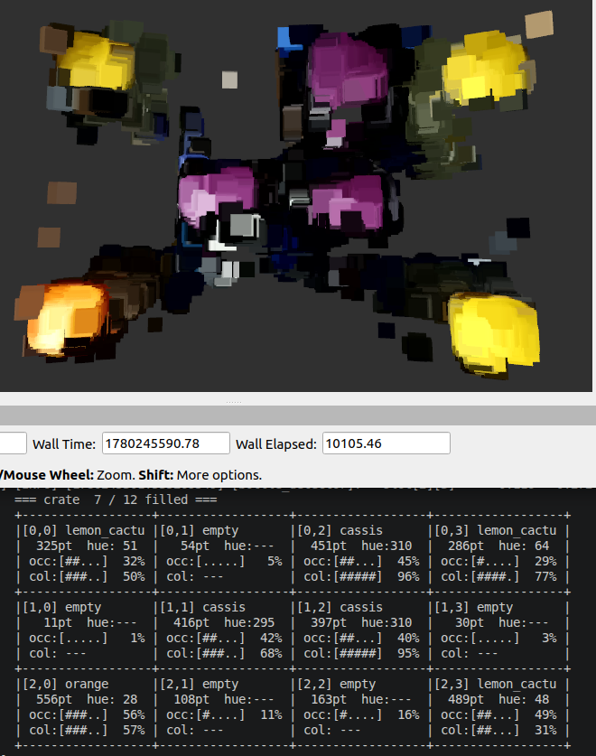

# james_perception

ROS2 package for 3D object detection on the James robot. Detects plastic soda bottles in a crate by processing point clouds from the OAK-D Pro camera. The camera looks down at the crate; the detector identifies which of the 12 slots contain a bottle and what colour the cap is.



## How it works

1. **Tilt correction** — rotates the point cloud to compensate for camera tilt relative to the crate surface
2. **ROI filter** — keeps only the points inside a configurable 3D bounding box that covers the crate opening
3. **Voxel grid** — downsamples to 5 mm voxels
4. **Grid occupancy** — divides the crate into a rows × cols grid; counts points per slot
5. **Cap colour** — computes the dominant HSV hue of the cap points per slot and matches it against configured colours
6. **Publishes** detections as `vision_msgs/Detection3DArray`, RViz2 markers, and debug point clouds

## Topics

| Topic | Type | Description |
|-------|------|-------------|
| `/oak/points` | `sensor_msgs/PointCloud2` | Input — from OAK-D Pro camera driver |
| `/james/detections` | `vision_msgs/Detection3DArray` | Output — one detection per filled slot |
| `/james/crate_cloud` | `sensor_msgs/PointCloud2` | Debug — filtered crate-only point cloud |
| `/james/slot_cloud` | `sensor_msgs/PointCloud2` | Debug — points coloured by slot index |
| `/james/bottle_markers` | `visualization_msgs/MarkerArray` | Debug — coloured bounding boxes in RViz2 |

## Slot positions

The XYZ coordinates in each detection come from the crate geometry parameters, **not** from the point cloud centroid. Once calibrated the slot coordinates are deterministic. The node logs the full slot map on startup:

```
[bottle_detector] Slot map (camera/oak frame, metres):
[bottle_detector]   slot        x        y        z
[bottle_detector]   slot[0][0]  -0.115  +0.185   0.830
...
```

## Cap colours

Three bottle types are pre-configured:

| Bottle | Cap colour | Default hue |
|--------|-----------|-------------|
| Lemon Cactus | Yellow | 60° |
| Orange | Orange | 20° |
| Cassis Blackberry | Purple | 308° |

The node logs the measured hue of each detected cap so you can calibrate the values for your lighting conditions.

## Terminal output

The node prints a live ASCII grid (~1 Hz) showing the state of all 12 slots:

```
=== crate  8 / 12 filled ===
+------------------+------------------+------------------+------------------+
|[0,0] lemon_cactu |[0,1] empty       |[0,2] cassis      |[0,3] lemon_cactu |
|  316pt  hue: 49  |   14pt  hue:---  |  478pt  hue:306  |  296pt  hue: 63  |
| occ:[#####] 100% | occ:[#....]  14% | occ:[#####] 100% | occ:[#####] 100% |
| col:[##...]  40% | col: ---         | col:[####.]  80% | col:[####.]  81% |
+------------------+------------------+------------------+------------------+
```

## Repository layout

```
james_perception/
├── check_dds.sh                        ← DDS diagnostics (see below)
├── sync_james_perception.sh            ← rsync from laptop to Jetson
├── docs/images/                        ← screenshots and diagrams
├── features/
│   └── bottle_detection.feature        ← Cucumber BDD scenarios
├── test/
│   ├── step_definitions/
│   │   └── bottle_detection_steps.cpp
│   └── test_data/
│       └── README.md                   ← how to record .pcd test files
└── src/james_perception/               ← ROS2 package root (colcon workspace)
    ├── CMakeLists.txt
    ├── package.xml
    ├── config/
    │   └── bottle_detector.yaml        ← all parameters (loaded at startup)
    ├── include/james_perception/
    │   └── bottle_detector.hpp
    ├── launch/
    │   └── bottle_detector.launch.py
    └── src/
        ├── bottle_detector.cpp
        └── bottle_detector_node.cpp
```

## Development workflow

During development, the package is **not** baked into the Docker image. Instead, the source is mounted as a volume (`/home/james/git/james_perception`) and built manually inside the container. This allows fast iteration without rebuilding the image (which takes hours).

```bash
# 1. Edit code on laptop

# 2. Sync to Jetson without committing (from repo root on laptop)
./sync_james_perception.sh

# 3. Build inside the Docker container on the Jetson
docker exec -it robojames bash
cd ~/git/james_perception
colcon build --symlink-install --packages-select james_perception

# 4. Run
source install/local_setup.bash
ros2 launch james_perception bottle_detector.launch.py

# 5. Commit only after it works on real hardware
```

`--symlink-install` means config and launch file changes take effect immediately — only C++ changes require a rebuild.

## Parameter tuning

All parameters can be changed live without restarting the node:

```bash
ros2 param set /bottle_detector crate_z_near 0.83
ros2 param set /bottle_detector min_points_per_slot 200
ros2 param set /bottle_detector cap_2_hue 308.0
```

Save the current values as the new defaults:

```bash
# On Jetson (node must be running):
ros2 param dump /bottle_detector \
  > ~/git/james_perception/src/james_perception/config/bottle_detector.yaml

# Pull back to laptop:
scp james@jetson-orin:~/git/james_perception/src/james_perception/config/bottle_detector.yaml \
  src/james_perception/config/bottle_detector.yaml
```

### Suggested tuning order

1. Start the camera and the detector
2. Add `/james/crate_cloud` in RViz2 (PointCloud2, Fixed Frame: `oak`, Color Transformer: `AxisColor` → Z)
3. Adjust `camera_tilt_x_deg` / `camera_tilt_y_deg` until the crate surface shows a uniform colour (no Z gradient)
4. Adjust `crate_z_near`, `crate_z_far`, `crate_x_min/max`, `crate_y_min/max` until the cloud shows only the crate interior
5. Add `/james/slot_cloud` to verify the grid alignment (each slot has a distinct colour)
6. Measure `min_points_per_slot`: note the max point count in empty slots and the min in filled slots; set the threshold between them
7. Place one bottle at a time; read `hue=XX` from the terminal grid and update `cap_N_hue`
8. Add `/james/bottle_markers` to see coloured bounding boxes per detected bottle
9. Save parameters with `ros2 param dump`

## DDS diagnostics — check_dds.sh

If ROS2 topics from the Jetson are not visible on the laptop (or vice versa), run this script on **both** machines and compare the output.

```bash
# On laptop (from repo root):
./check_dds.sh

# Inside the Docker container on the Jetson:
cd ~/git/james_perception
./check_dds.sh

# Let the script attempt automatic fixes:
./check_dds.sh --fix
```

### Testing actual data transfer

DDS discovery (UDP) and data transfer (TCP) are separate in LARGE_DATA mode. Use the pub/sub test to verify the full data path:

```bash
# Step 1 — on the Jetson (in container):
./check_dds.sh --pub

# Step 2 — on the laptop (new terminal):
./check_dds.sh --sub
```

If `--sub` receives a message, the full DDS pipeline works. If it times out, TCP is likely blocked by a firewall even though `ros2 topic list` shows topics.

### Common fixes

| Symptom | Cause | Fix |
|---------|-------|-----|
| Only `/parameter_events` and `/rosout` on laptop | `FASTDDS_BUILTIN_TRANSPORTS` not set | `source setup_monitor_laptop.sh` once; adds to `~/.bashrc` |
| Topics appeared then disappeared | ROS2 daemon cached wrong DDS config | `ros2 daemon stop` then retry |
| `ros2 topic list` command not found in container | `ros2topic` package missing | `sudo apt-get install ros-humble-ros2topic` |
| Topics visible but point cloud drops frames | WiFi instead of ethernet | Connect both machines via wired switch |

## Requirements

- ROS2 Humble
- PCL 1.12
- `ros-humble-pcl-conversions`, `ros-humble-pcl-ros`
- `ros-humble-vision-msgs`
- `ros-humble-visualization-msgs`
- OAK-D Pro with `depthai_ros_driver` publishing `/oak/points`
